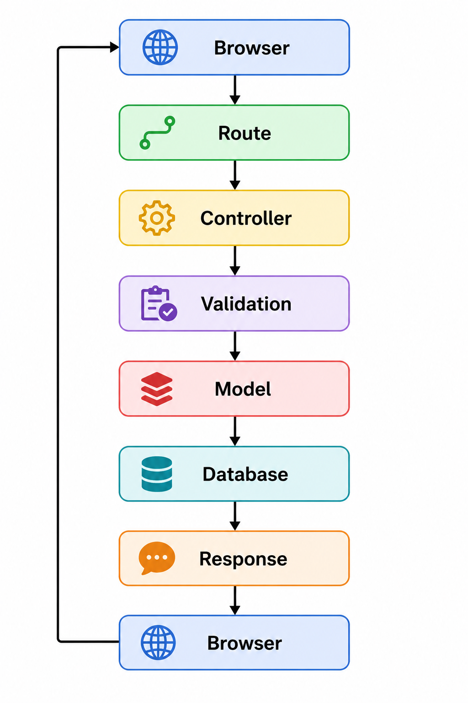
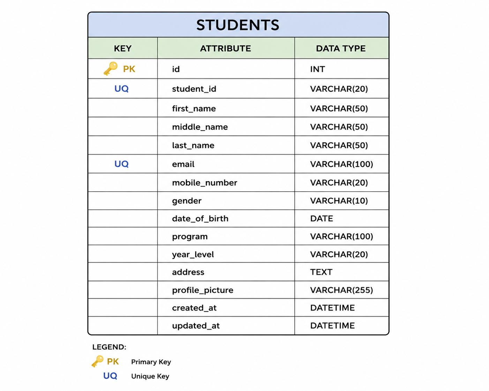
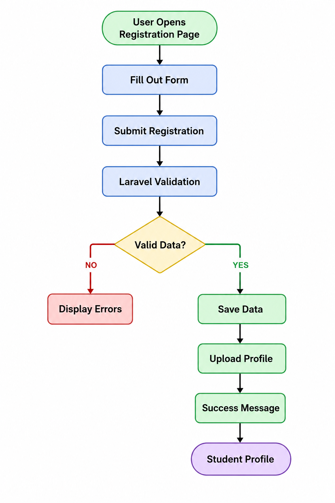

# Student Registration System

## ITST 302 – Client-Server Technologies

### Week 4 Laboratory Activity – Mini Project 03

A Laravel-based Student Registration System that allows students to register their information online, upload a profile picture, and securely store their information in a MySQL database.

---

## 1. Introduction

The Student Registration System is a web-based application developed using Laravel. The purpose of this system is to provide a simple digital registration process where students can submit their personal and academic information through an online form.

The system demonstrates important client-server technologies, including Laravel Blade Forms, request handling, server-side validation, database integration, flash messages, and file uploading. Instead of collecting student information manually, the system allows the submitted data to be processed and stored in a MySQL database.

Data validation is an important part of the system because it prevents incomplete, invalid, or duplicate information from being stored in the database. The application also validates uploaded profile pictures to ensure that only supported image files are accepted.

This project demonstrates how registration systems can be used in real-world enterprise applications such as universities, companies, hospitals, banks, and government agencies.

---

## 2. Objectives

The objectives of this project are:

* Create a professional student registration form using Laravel Blade.
* Process client requests using a Laravel controller.
* Implement server-side validation.
* Prevent invalid and duplicate submissions.
* Display validation error messages.
* Display a success flash message after registration.
* Upload and securely store student profile pictures.
* Store student information in a MySQL database.
* Display registered student information through a student profile page.
* Understand the Laravel request lifecycle.
* Practice Git and GitHub version control.
* Document the software development process.

---

## 3. System Features

The Student Registration System includes the following features:

### Student Registration

Students can enter the following information:

* Student ID
* First Name
* Middle Name
* Last Name
* Email Address
* Mobile Number
* Date of Birth
* Gender
* Program
* Year Level
* Address
* Profile Picture

### Server-Side Validation

The system checks the submitted information before saving it to the database.

The validation includes:

* Required fields
* Unique Student ID
* Unique email address
* Valid email format
* Numeric mobile number
* Valid date
* Required gender
* Required program
* Required year level
* Required address
* Image file validation
* JPG, JPEG, and PNG file types
* Maximum profile-picture size of 2 MB

### File Upload

Students can upload a profile picture during registration. The uploaded image is stored using Laravel Storage.

### Flash Message

After successful registration, the system displays:

> Student registered successfully!

### Student Profile

After registration, the system displays the student's submitted information together with the uploaded profile picture.

### Student List

The system also provides a page where registered students can be viewed and selected to open their individual profiles.

---

## 4. Laravel Request Lifecycle

The registration process follows the Laravel request lifecycle:

```text
Browser
   ↓
Route
   ↓
Controller
   ↓
Validation
   ↓
Model
   ↓
Database
   ↓
Response
   ↓
Browser
```

### Process Explanation

**1. Browser**

The student opens the registration page and fills out the registration form.

**2. Route**

The Laravel route receives the request and directs it to the appropriate controller method.

**3. Controller**

The `StudentController` processes the request and prepares the submitted information.

**4. Validation**

Laravel validates the submitted information based on the required validation rules.

**5. Model**

The `Student` model is used to create the student record.

**6. Database**

The validated student information is stored in the MySQL `students` table.

**7. Response**

Laravel redirects the student to the student profile page and sends a success flash message.

**8. Browser**

The browser displays the registered student's information and uploaded profile picture.

### Request Lifecycle Diagram



---

## 5. Validation Rules

The system uses server-side validation to make sure that submitted information is correct before it is stored.

| Field           | Validation                                  |
| --------------- | ------------------------------------------- |
| Student ID      | Required and unique                         |
| First Name      | Required, string, maximum 100 characters    |
| Middle Name     | Optional, string, maximum 100 characters    |
| Last Name       | Required, string, maximum 100 characters    |
| Email           | Required, valid email, unique               |
| Mobile Number   | Required and numeric                        |
| Date of Birth   | Required and valid date                     |
| Gender          | Required                                    |
| Program         | Required                                    |
| Year Level      | Required                                    |
| Address         | Required                                    |
| Profile Picture | Required, image, JPG/JPEG/PNG, maximum 2 MB |

### Why Validation Is Important

Validation prevents incorrect information from being submitted to the system. Required-field validation prevents incomplete registrations, while unique constraints prevent duplicate Student IDs and email addresses.

Email validation ensures that the entered email follows a valid email format. Numeric validation helps ensure that the mobile number contains numeric data.

Image validation prevents unsupported files from being uploaded. The file-size restriction also helps prevent excessively large files from being stored.

---

## 6. Database Design

The system uses a MySQL database named:

```text
week04_student_registration
```

The main table is:

```text
students
```

### Students Table

| Column          | Data Type | Description                 |
| --------------- | --------- | --------------------------- |
| id              | BIGINT    | Primary key                 |
| student_id      | VARCHAR   | Unique student ID           |
| first_name      | VARCHAR   | Student first name          |
| middle_name     | VARCHAR   | Student middle name         |
| last_name       | VARCHAR   | Student last name           |
| email           | VARCHAR   | Unique email address        |
| mobile_number   | VARCHAR   | Student mobile number       |
| gender          | VARCHAR   | Student gender              |
| date_of_birth   | DATE      | Student date of birth       |
| program         | VARCHAR   | Student academic program    |
| year_level      | VARCHAR   | Student year level          |
| address         | TEXT      | Student address             |
| profile_picture | VARCHAR   | Stored profile-picture path |
| created_at      | TIMESTAMP | Record creation time        |
| updated_at      | TIMESTAMP | Record update time          |

### Primary Key

The `id` column is the primary key of the `students` table.

### Unique Constraints

The following fields must contain unique values:

* `student_id`
* `email`

### ER Diagram



---

## 7. Registration Flowchart

The registration process follows these steps:

```text
User Opens Registration Page
          ↓
     Fill Out Form
          ↓
   Submit Registration
          ↓
   Laravel Validation
          ↓
      Valid Data?
       ↙       ↘
     NO         YES
     ↓           ↓
Display Errors  Save Data
                 ↓
           Upload Profile
                 ↓
          Success Message
                 ↓
        Student Profile
```

### Flowchart



---

## 8. Project Structure

The important project files are organized as follows:

```text
week04-student-registration/
│
├── app/
│   ├── Http/
│   │   └── Controllers/
│   │       └── StudentController.php
│   │
│   └── Models/
│       └── Student.php
│
├── database/
│   └── migrations/
│       └── create_students_table.php
│
├── resources/
│   └── views/
│       └── students/
│           ├── create.blade.php
│           ├── index.blade.php
│           └── show.blade.php
│
├── routes/
│   └── web.php
│
├── storage/
│   └── app/
│       └── public/
│
├── screenshots/
│
├── documentation/
│
├── .env
├── artisan
└── README.md
```

---

## 9. Screenshots

### Registration Form


The registration form allows students to enter their personal and academic information.

### Validation Errors


The system displays validation errors when required information is missing or invalid.

### Successful Registration


The system displays a success message after the student has been successfully registered.

### Uploaded Profile Picture


The student's uploaded profile picture is displayed on the profile page.

### Student List


The student list displays registered students stored in the system.

### Database Records


The registered student information can be viewed in the MySQL database.

### Project Structure


The screenshot shows the Laravel project structure in Visual Studio Code.

### Terminal


The terminal shows the Laravel development server and Artisan commands used during development.

### Browser Output


The browser displays the working Student Registration System.

---

## 10. Problems Encountered

### Problem 1 – MySQL Connection

One challenge encountered during development was connecting the Laravel application to the MySQL database. The database configuration in the `.env` file needed to match the local MySQL server configuration.

### Problem 2 – Validation

Another challenge was making sure that validation errors were displayed correctly when users submitted incomplete or invalid information.

### Problem 3 – Profile Picture Upload

The profile picture upload required additional configuration because Laravel stores uploaded files using its Storage system. The storage link needed to be created so that uploaded images could be accessed from the browser.

---

## 11. Solutions

### Solution 1 – MySQL Configuration

The database settings in the `.env` file were configured to use MySQL:

```env
DB_CONNECTION=mysql
DB_HOST=127.0.0.1
DB_PORT=3306
DB_DATABASE=week04_student_registration
DB_USERNAME=root
DB_PASSWORD=
```

After configuring the database, Laravel migrations were executed using:

```bash
php artisan migrate
```

### Solution 2 – Validation

Laravel's `$request->validate()` method was used inside the `StudentController` to validate the submitted information before creating a database record.

### Solution 3 – Storage Link

The Laravel storage link was created using:

```bash
php artisan storage:link
```

This allowed uploaded profile pictures stored in Laravel's public storage directory to be displayed in the browser.

---

## 12. Reflection

This activity helped me understand the importance of validating user input in a web application. I learned that a registration system should not simply accept information from users and immediately save it to a database. The submitted information needs to be checked first to make sure that required fields are completed, email addresses are valid, and unique information such as Student ID and email addresses are not duplicated.

I also learned how Laravel handles requests from the browser through routes and controllers. The route directs the request to the appropriate controller, where the submitted information is validated and processed. After validation, the Student model is used to store the information in the MySQL database. Understanding this process helped me see how the different parts of a Laravel application work together.

Another important lesson from this activity was the difference between client-side and server-side validation. Client-side validation can provide immediate feedback to users, but server-side validation is necessary because the server must independently verify submitted information before accepting it. This provides an additional layer of protection against invalid or unexpected input.

The file-upload feature also taught me the importance of handling files carefully in web applications. Profile pictures should be checked to make sure that only allowed image types and file sizes are accepted. Laravel Storage provides a structured way to manage uploaded files and makes it easier to organize them.

Overall, this project improved my understanding of form processing, validation, database integration, file uploading, and Laravel's request lifecycle. These skills are useful beyond a student registration system because similar processes are used in enterprise applications such as school systems, company information systems, healthcare applications, and other data-driven web applications.

---

## 13. References

Laravel. (n.d.). *Laravel documentation*.
https://laravel.com/docs

PHP. (n.d.). *PHP documentation*.
https://www.php.net/docs.php

MySQL. (n.d.). *MySQL documentation*.
https://dev.mysql.com/doc/

Tailwind CSS. (n.d.). *Tailwind CSS documentation*.
https://tailwindcss.com/docs

MDN Web Docs. (n.d.). *MDN Web Docs*.
https://developer.mozilla.org/

---

## 14. Technologies Used

* Laravel
* PHP
* MySQL
* MySQL Workbench
* Blade Templates
* HTML
* CSS
* Laravel Storage
* Git
* GitHub
* Visual Studio Code

---

## 15. How to Run the Project

### Step 1 – Clone the Repository

```bash
git clone <your-github-repository-link>
```

### Step 2 – Open the Project

```bash
cd week04-student-registration
```

### Step 3 – Install Dependencies

```bash
composer install
```

### Step 4 – Configure Environment

Create your `.env` file and configure the MySQL database.

### Step 5 – Run Migrations

```bash
php artisan migrate
```

### Step 6 – Create Storage Link

```bash
php artisan storage:link
```

### Step 7 – Start the Laravel Server

```bash
php artisan serve
```

### Step 8 – Open the Application

Open:

```text
http://127.0.0.1:8000
```

---

## 16. Conclusion

The Student Registration System demonstrates the basic principles of client-server application development using Laravel. The project combines Blade forms, request handling, server-side validation, database integration, flash messages, and file uploads into one functional application.

Through this project, the registration process was transformed into a digital system that can collect, validate, store, and display student information efficiently. The project also provides practical experience with Laravel development, MySQL database management, Git version control, and technical documentation.
